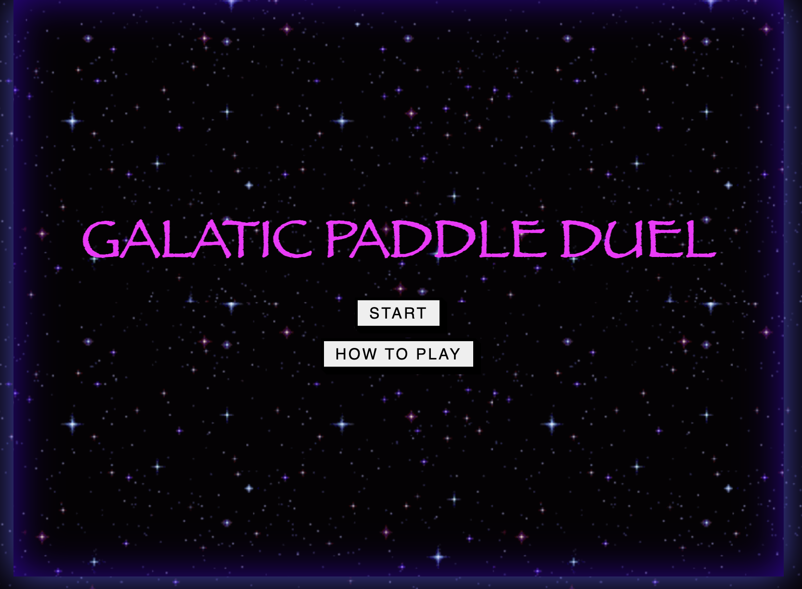
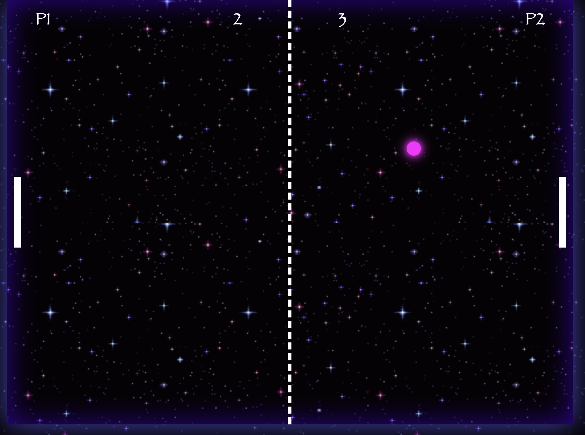

# Galatic Paddle Duel

## Description

Galactic Paddle Duel is an exciting space-themed browser game where players engage in fast-paced paddle duels set amidst the cosmic backdrop of the galaxy.

Players control their paddles to deflect a cosmic ball and score points against their opponent.

## Technologies Used

Javascript, HTML, CSS

## Getting Started

To play Galatic Paddle Duel, follow these steps:

1. Go to https://ftech-glitch.github.io/galatic-paddle-duel/
2. Use the 'W' and 'S' keys (Player 1) or arrow keys (Player 2) to move your paddle.
3. Score points by deflecting the cosmic ball past your opponent's paddle.
4. The game ends when one player reaches a score of 10.

## Next Steps

Planned future enhancements for Galatic Paddle Duel include:

- Adding additional power-ups and obstacles for enhanced gameplay variety.
- Enhancing the visual effects and animations for a mor immersive experience.

## Reference

GeeksforGeeks Development. "Make a Pong Game Using JavaScript (part 1)" YouTube, uploaded Jan 14, 2023, https://www.youtube.com/watch?v=uCHUvjFEihI

GeeksforGeeks Development. "Make a Pong Game Using JavaScript (part 2)" YouTube, uploaded Jan 15, 2023, https://www.youtube.com/watch?v=-kweMvxVMk8
